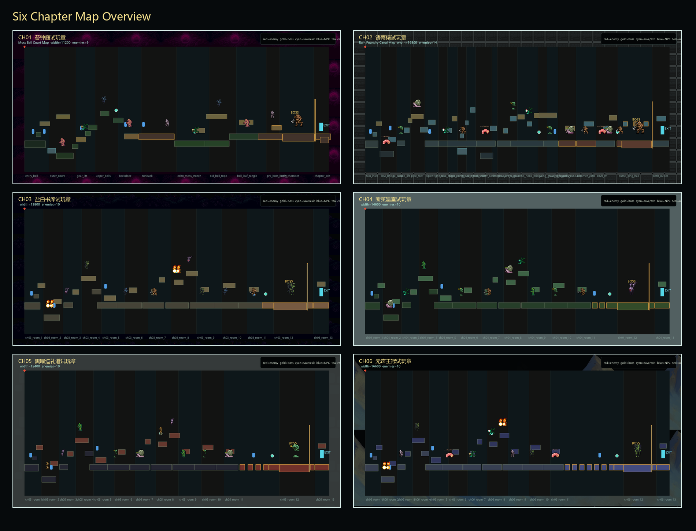
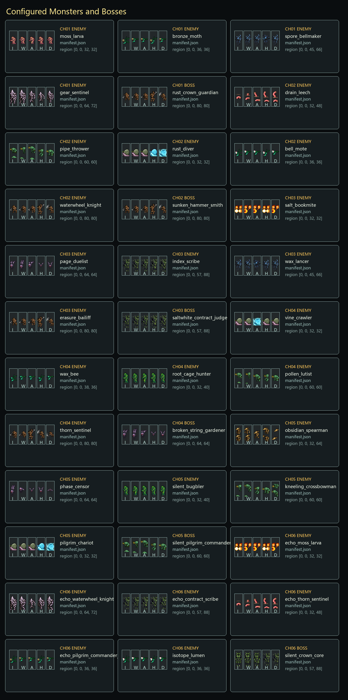

# Crimson Thread Pilgrimage / 绯线巡礼

一个 Godot 4.6 2D 动作平台游戏原型。当前仓库包含六章试玩配置、横版战斗、方向劈砍/下劈反弹、主动进攻敌人 AI、Boss 房锁门、存档点恢复、Metroidvania 地图桥接、素材处理脚本和本地回归验证。

> 本项目是学习与原型用途的独立工程，不包含任何第三方商业 IP 资源。代码按 MIT 发布；第三方素材分别遵守各自许可证。

## 预览





## 运行 Godot 项目

需要：

- Godot 4.6.x
- Python 3.10+，用于素材/数据验证脚本
- Node.js 18+，仅用于旧版浏览器原型和 smoke test

启动：

```powershell
godot --path godot
```

主场景：

```text
godot/scenes/Main.tscn
```

常用验证：

```powershell
godot --headless --path godot --script res://scripts/demo_validation.gd
godot --headless --path godot --script res://scripts/ch02_demo_validation.gd
godot --headless --path godot --script res://scripts/combat_validation.gd
godot --headless --path godot --script res://scripts/all_chapters_demo_validation.gd

python tools\validate_chapter_files.py
python tools\validate_open_asset_policy.py
python tools\validate_itch_enemy_assets.py
python tools\render_demo_visuals.py
```

旧版浏览器原型：

```powershell
npm run check
npm test
npm start
```

然后打开 `http://127.0.0.1:5173/`。

## 当前内容

- 六章试玩数据：`godot/data/demo_ch01_*.json` 到 `godot/data/demo_ch06_*.json`
- 章节策划数据：`godot/data/chapters`
- Godot 主逻辑：`godot/scripts/main_level.gd`
- 玩家控制器：`godot/scripts/player_controller.gd`
- 敌人/Boss AI：`godot/scripts/enemy_actor.gd`
- Metroidvania System 插件：`godot/addons/MetroidvaniaSystem`
- 素材处理和验证脚本：`tools`
- 设计、决策、发布记录：`docs`

## 素材授权边界

可随本仓库发布的主要素材：

- Kenney assets: CC0
- GothicVania Cemetery / Ansimuz: Public Domain / 商用友好记录
- OpenGameArt Dark Fantasy Platformer Bestiary: CC-BY 系列来源，已在项目 NOTICE 中记录署名
- Godot Platformer 2D: MIT
- Metroidvania System: MIT
- 项目自制/生成运行资源：主角关键帧、部分 UI/验证产物和脚本生成图

不会随公开仓库发布的本地受限素材：

- Maaot / Mossy Cavern
- Arhimed122 / Abyss Bug Sprite Pack
- MonoPixelArt / Forest Monsters 2D Pixel Art FREE

详细清单见：

- [不可再分发素材包清单与开源边界](docs/decision/20260616162014251_不可再分发素材包清单与开源边界.md)
- [Third Party Notices](THIRD_PARTY_NOTICES.md)
- [Godot asset notice](godot/assets/NOTICE.md)

这些受限素材可能存在于本地开发缓存或历史文档中，但已从公开运行时引用中移除，并由 `.gitignore` 排除。

## 开源发布范围

提交范围包括：

- Godot 工程核心文件
- 运行所需且可再分发的素材
- 文档、验证脚本、展示图
- Web 原型和 smoke tests

提交范围排除：

- `artifacts/source_repos`
- `artifacts/source_assets`
- `artifacts/third_party`
- `artifacts/debug`
- `godot/.godot`
- `tmp`
- 本地受限素材目录和对应导入脚本

## License

项目代码使用 MIT License。第三方素材、插件、音频和字体等按各自许可证使用，详见 `THIRD_PARTY_NOTICES.md` 和各素材目录下的 NOTICE/LICENSE 文件。
