# 第一章大体量地图与点位设计文档

项目：绯线巡礼 / Godot 版 Metroidvania  
章节：第一章 苔钟庭  
版本：v1  
目标：把当前小 demo 扩展为一个足够大的原创章节地图，路线新鲜、不重复跑同一段路，并明确每个点位放什么怪物、陷阱、奖励和门禁。

## 1. 设计立场

这份设计不照搬《丝之歌》或任何商业游戏地图。可学习的是 Metroidvania 的通用结构：大地图、能力门、捷径、回访、战斗节奏、区域主题变化。地图、房间、怪物组合、路线节奏和故事节点全部重新设计。

参考方向：

- KoBeWi/Metroidvania-System：学习 Godot 房间图谱、地图显示、收藏物追踪、对象持久化。
- itch.io Metroidvania Tools：学习地图草图工具、布局生成器、节奏图工具。
- itch.io / Kenney / OpenGameArt：作为 tileset、图标、敌人、UI 的素材来源，不作为地图结构来源。

## 2. 章节体量硬指标

当前 demo 是 12 个房间、9 个敌人点、9 个陷阱点。第一章正式版目标扩大为：

| 指标 | 目标 |
|---|---:|
| 房间数量 | 32 个 |
| 子区域数量 | 6 个 |
| 世界外框 | 19200px 宽，3600px 高 |
| 可行走路径估算 | 31000px 到 36000px |
| 主线首次通关 | 55 到 75 分钟 |
| 全收集 | 120 到 150 分钟 |
| 普通敌人点 | 62 到 74 个 |
| 精英敌人点 | 7 到 9 个 |
| 陷阱点 | 38 到 46 个 |
| NPC | 8 个 |
| 检查点 | 6 个 |
| 明确捷径 | 9 条 |
| 可回访能力门 | 11 个 |
| 可选奖励房 | 8 个 |
| 主线重复路线比例 | 小于 18% |

重复路线定义：玩家在主线推进中被迫再次走过同一房间的同一条平台路径。如果再次经过同一房间，但走的是上层、下层、反向机关线、崩塌后新线或捷径线，不算重复。

## 3. 地图核心幻想

苔钟庭是一座建在倒扣巨钟外壁上的荒废庭院。地图不是平面长廊，而是围绕一口巨大沉默钟形成的三层环形结构：

- 外环：新手庭院和苔桥，教基础移动与近战距离。
- 下环：根井和暗流，教低视野、陷阱读秒、敌人间距。
- 中轴：齿轮升井，把下层和上层连接起来。
- 上环：悬钟廊和断桥，教空中路线和冲刺门。
- 内环：后门礼拜堂与王冠回廊，形成 Boss 前回路。
- 核心：锈冠殿，Boss 战。

玩家感受应该是：每次回到熟悉区域，都从新的高度、新的方向或新的机关状态进入，而不是沿原路倒着走。

## 4. 路线结构

### 4.1 主线大图

```mermaid
flowchart LR
    R01["R01 静音门阶"] --> R02["R02 起步苔桥"]
    R02 --> R03["R03 三岔钟庭"]
    R03 --> R06["R06 根井入口"]
    R06 --> R07["R07 假苔下坡"]
    R07 --> R08["R08 苔壳巢"]
    R08 --> R09["R09 下层巡礼道"]
    R09 --> R10["R10 第一检查灯"]
    R10 --> R11["R11 齿轮升井底"]
    R11 --> R12["R12 升井一层"]
    R12 --> R13["R13 升井二层"]
    R13 --> R14["R14 升井顶桥"]
    R14 --> R16["R16 悬钟廊西"]
    R16 --> R17["R17 断钟桥"]
    R17 --> R18["R18 铜蛾温床"]
    R18 --> R19["R19 钟针踏步室"]
    R19 --> R20["R20 上层回环廊"]
    R20 --> R22["R22 后门礼拜堂"]
    R22 --> R24["R24 静香祭坛"]
    R24 --> R25["R25 王冠回廊西"]
    R25 --> R28["R28 王冠回廊东"]
    R28 --> R31["R31 首领钟门"]
    R31 --> R32["R32 锈冠殿"]

    R03 -. "捷径A：升井回落后打开" .-> R14
    R10 -. "捷径B：检查灯电梯" .-> R03
    R20 -. "捷径C：上层断桥落回三岔庭" .-> R03
    R22 -. "捷径D：后门直连王冠回廊" .-> R28
    R25 -. "捷径E：Boss前回跑线" .-> R10
```



### 4.2 非重复路线规则

1. 三岔钟庭是视觉中心，但主线只在不同高度经过三次：地面、上层桥、后门电梯。
2. 根井线只前进一次，回程用电梯，不让玩家反跑下坡。
3. 齿轮升井是垂直关卡，玩家向上推进；开捷径后从侧门返回，不走原来的跳台。
4. 上层悬钟廊崩塌后形成新落点，回到三岔庭时落在之前看得见但到不了的平台。
5. Boss 前回跑不是长走廊，而是 3 个短房间加 1 条后门捷径。
6. 可选奖励房可以回访，但每个奖励房在首次经过时都提供视觉预告，回访时走新门或新能力路线。

## 5. 玩家能力与门禁

| 能力/道具 | 获得位置 | 用途 | 门禁类型 |
|---|---|---|---|
| 苔光镜 | R04 地图师小屋 | 显示已探索房间、目标点、可回访门 | map_reveal |
| 绯线冲刺 | R10 第一检查灯后 | 穿过短钟隙、躲落钟、进上层支线 | dash_gap |
| 钟针踏步 | R19 钟针踏步室 | 击打钟针踏点后获得一次上抬 | bell_step |
| 后门拉杆 | R22 后门礼拜堂 | 开 Boss 前捷径 | shortcut_state |
| 王冠印记 | R32 Boss 掉落 | 进入第二章铸雨渠 | chapter_gate |

第一章只给两个核心行动变化：绯线冲刺和钟针踏步。这样地图足够大，但不会把能力系统一下子铺太散。

## 6. 敌人与攻击职责

所有敌人只做近战或身体范围攻击，不做远程法术。

| 敌人 | 定位 | 攻击方式 | 主要投放场景 |
|---|---|---|---|
| Moss Larva 苔壳幼兽 | 基础地面怪 | 短冲、壳撞、钻咬 | 新手庭、根井 |
| Bronze Moth 铜蛾 | 空中压迫怪 | 俯冲、翼撞、贴身震翅 | 苔桥、悬钟廊 |
| Spore Bellmaker 孢钟匠 | 慢速区域压迫 | 身体钟鸣、根推、腹撞 | 根井、祭坛 |
| Gear Sentinel 齿轮守卫 | 精英重怪 | 冲撞、锯臂、踏地 | 升井、王冠回廊 |
| Bell Husk 空壳司铃 | 盾型怪 | 挡路、盾撞、短反击 | 后门礼拜堂 |
| Thread Leech 线蛭 | 墙面怪 | 墙爬扑击、吊落、贴身撕咬 | 根井、暗洞 |
| Crown Cricket 冠蟋 | 跳跃怪 | 高跳压身、二段反跳、落地冲 | 上层钟廊 |
| Rust Crown Guardian 锈冠守卫 | Boss | 王冠砸地、横冲、钟舌撞、背手扫、震地 | 锈冠殿 |

敌人组合原则：

- 教学房只放 1 种敌人。
- 普通战斗房最多 2 种敌人。
- 精英房最多 1 精英 + 1 小怪，不堆 3 种。
- 同屏同时攻击敌人不超过 3 只。
- Boss 前 3 个房间减少数量，提高单体威胁。

## 7. 32 房间点位表

标记说明：

- E = 敌人点
- H = 陷阱点
- R = 奖励点
- N = NPC
- S = 检查点
- G = 门禁或机关
- 坐标用房间内百分比描述，便于后续换算成 Godot 坐标。

| 房间 | 尺寸 | 职责 | 路线新意 | 点位设计 |
|---|---:|---|---|---|
| R01 静音门阶 / Silent Gate Steps | 680x360 | 开场安全房 | 只向右，建立尺度 | N@20% 织线学徒；R@72% 小能量；无敌人 |
| R02 起步苔桥 / Starter Moss Bridge | 920x420 | 基础跳跃和首怪 | 上桥拿奖励，下桥继续 | E@58% Moss Larva 1；H@76% 小钟隙；R@35% 松脂碎片 |
| R03 三岔钟庭 / Three-Bell Court | 1240x620 | 中央视觉 Hub | 地面、上桥、后门三层入口 | N@28% 守门朝圣者；G@72% 正门封锁；R@88% 看得见拿不到 |
| R04 地图师小屋 / Cartographer Nook | 520x300 | 地图系统 | R03 上方小支线 | N@50% 地图师；R@55% 苔光镜；无敌人 |
| R05 封钟正门 / Sealed Front Bell | 760x460 | 预告后期门 | 从正面不能过，后期从背面开 | G@80% 王冠门；E@42% Bell Husk 1；R@20% 低价值奖励 |
| R06 根井入口 / Rootwell Mouth | 980x620 | 进入下层 | 斜坡单向下落，不可原路返回 | E@34% Moss Larva 1；E@70% Thread Leech 1；H@82% 假苔边缘 |
| R07 假苔下坡 / False Moss Slope | 1120x540 | 陷阱教学 | 下坡追怪，末端安全台 | H@30% 假苔；H@62% 假苔；E@48% Moss Larva 2；R@85% 血能补给 |
| R08 苔壳巢 / Chitin Nest | 900x500 | 小型战斗房 | 中间低洼，左右高台 | E@35% Moss Larva 2；E@66% Thread Leech 1；R@72% 苔壳材料 |
| R09 下层巡礼道 / Lower Pilgrim Road | 1360x560 | 长距离压力 | 三段平台，每段节奏不同 | E@22% Bronze Moth 1；E@55% Moss Larva 1；H@74% 钟隙；R@90% 地图残页 |
| R10 第一检查灯 / First Lamp Lift | 720x460 | 检查点和能力 | 获得绯线冲刺，电梯回 Hub | S@35%；R@50% 绯线冲刺；G@70% 电梯回 R03 |
| R11 齿轮升井底 / Gear Shaft Base | 840x720 | 垂直关卡入口 | 从横向变竖向 | E@42% Gear Sentinel 1；H@64% 活塞；R@16% 松脂 |
| R12 升井一层 / Gear Shaft I | 780x820 | 冲刺跳教学 | 两条竖线，右线更难 | H@35% 横移齿轮；E@58% Bronze Moth 1；R@72% 护符槽碎片 |
| R13 升井二层 / Gear Shaft II | 820x860 | 精英试炼 | 中段安全台可喘息 | E@48% Gear Sentinel 1；E@70% Moss Larva 1；H@62% 压轮；R@18% 可选矿 |
| R14 升井顶桥 / Gear Crown Bridge | 1160x420 | 到达上层 | 顶桥看见 R03 全景 | E@46% Bronze Moth 2；G@12% 捷径门回 R03；R@82% 地图标记 |
| R15 回声暗洞 / Echo Side Hollow | 760x480 | 可选奖励房 | 需要冲刺进入 | E@52% Thread Leech 2；H@75% 假墙刺；R@84% 快缝针护符 |
| R16 悬钟廊西 / Hanging Bell West | 1180x540 | 上层主路 | 悬挂平台横向移动 | E@32% Crown Cricket 1；H@55% 落钟；R@68% 松脂 |
| R17 断钟桥 / Broken Bell Span | 1420x620 | 大跳跃房 | 断桥分上下两条，不可重复 | E@45% Bronze Moth 1；E@72% Crown Cricket 1；H@60% 长钟隙；R@88% 血结碎片 |
| R18 铜蛾温床 / Bronze Moth Roost | 980x520 | 空中怪组合 | 上层绕路，下层危险 | E@38% Bronze Moth 2；H@48% 落钟预警；R@18% 可见不可拿 |
| R19 钟针踏步室 / Bell-Pin Step Room | 860x760 | 获得钟针踏步 | 竖向训练，不回头 | R@50% 钟针踏步；H@65% 小刺阵；N@25% 司铃残影 |
| R20 上层回环廊 / Upper Loop Gallery | 1280x560 | 开大回环 | 用新能力从背面打开 R03 上桥 | E@38% Crown Cricket 2；G@80% 背面拉杆；R@92% 快捷门 |
| R21 被吞名字间 / Name-Eaten Cell | 680x440 | 剧情奖励房 | 需要钟针踏步进入 | N@45% 失名朝圣者；R@70% 证词1；无敌人 |
| R22 后门礼拜堂 / Backdoor Chapel | 1120x520 | 后门安全和机关 | 从上层进入，开 Boss 捷径 | N@30% 后门司铃人；S@45%；G@78% 后门拉杆；E@88% Bell Husk 1 |
| R23 咬合门缝 / Biting Door Seam | 940x480 | 机关陷阱房 | 门缝节奏，不是纯跳跃 | H@32% 咬合门；H@58% 咬合门；E@70% Moss Larva 1；R@18% 松脂 |
| R24 静香祭坛 / Quiet Resin Altar | 820x430 | 回复和商店预告 | 安静房后接高压房 | N@40% 祭坛商人；R@62% 护符提示；无敌人 |
| R25 王冠回廊西 / Crown Runback West | 1180x520 | Boss 前一段 | 少怪但压迫强 | E@44% Gear Sentinel 1；H@68% 假灯；R@20% 能量补给 |
| R26 沉钟侧厅 / Sunken Bell Side Hall | 760x520 | 可选精英房 | 入口近，出口回 R25 | E@48% Bell Husk 1；E@66% Crown Cricket 1；R@82% 长线护符 |
| R27 苔雨排水井 / Moss Rain Drain | 1040x700 | 隐藏支线 | 从 R24 下落进入，回 R11 | E@35% Thread Leech 2；H@64% 水下刺；R@78% 证词2；G@92% 单向门回升井 |
| R28 王冠回廊东 / Crown Runback East | 1260x500 | Boss 前二段 | 横向短跑，训练冲刺躲撞 | E@40% Gear Sentinel 1；E@72% Bronze Moth 1；R@88% 检查补给 |
| R29 空钟观景台 / Hollow Bell Vista | 620x360 | 情绪缓冲 | 看见 Boss 房背景，不战斗 | N@45% 回廊斥候；R@70% 地图补全 |
| R30 断誓小室 / Broken Oath Cell | 720x480 | 真结局伏笔 | 需要钟针踏步和冲刺组合 | H@40% 双刺阵；R@65% 证词3；无敌人 |
| R31 首领钟门 / Boss Bell Gate | 820x440 | Boss 门和最终准备 | 后门捷径直接连到这里 | S@24%；G@70% 首领钟门；R@42% 60能量补给 |
| R32 锈冠殿 / Rust Crown Hall | 1480x720 | Boss 战 | 大场地，左右柱子可断 | Boss@55% Rust Crown Guardian；H@25/75% 可碎柱；R@50% 王冠印记 |

## 8. 区域节奏表

| 区域 | 房间 | 强度曲线 | 目的 |
|---|---|---|---|
| 外环新手庭 | R01-R05 | 1,1,1,0,2 | 教移动、地图预告、封门 |
| 根井下层 | R06-R10 | 2,3,3,3,0 | 教陷阱和距离，给冲刺 |
| 齿轮升井 | R11-R15 | 3,3,4,2,4 | 垂直移动和精英压力 |
| 悬钟上廊 | R16-R21 | 3,4,4,1,3,0 | 空中威胁，给钟针踏步，开回环 |
| 后门礼拜堂 | R22-R27 | 1,3,0,4,4,4 | 安全点后连续高压支线 |
| 王冠核心 | R28-R32 | 4,0,4,0,5 | Boss 前准备、伏笔、Boss |

强度 0 是安全房，1 是低压，5 是 Boss 或章节级高压。

## 9. 奖励与回访设计

奖励必须看得见、暂时拿不到、拿到能力后从新路线进入。

| 奖励 | 首次看见 | 实际获取 | 回访能力 | 设计作用 |
|---|---|---|---|---|
| 地图残页 | R09 | R09 下层支台 | 冲刺 | 让玩家意识到冲刺能改变横向路径 |
| 快缝针护符 | R15 | R15 暗洞末端 | 冲刺 | 鼓励回看升井侧墙 |
| 血结碎片 | R17 | R17 上桥 | 钟针踏步 | 强化竖向观察 |
| 证词1 | R21 | R21 剧情房 | 钟针踏步 | 真结局伏笔 |
| 长线护符 | R26 | R26 精英房 | 后门状态 | Boss 前可选强化 |
| 证词2 | R27 | R27 隐藏井 | 钟针踏步 | 把下层和升井重新连接 |
| 证词3 | R30 | R30 断誓小室 | 冲刺 + 钟针踏步 | 终局伏笔 |
| 王冠印记 | R32 | Boss 掉落 | 击败 Boss | 开第二章 |

## 10. Boss 前回跑设计

Boss 前不做长跑图。玩家死亡后从 R31 检查点复活：

- R31 到 R32 只需要 12 到 18 秒。
- 如果从 R22 后门礼拜堂出发，到 R31 需要 45 到 60 秒。
- R25-R28 是首次推进时的紧张路线，开捷径后可以跳过一半。
- R29 是无战斗观景台，用来降压，不让 Boss 前一直紧绷。

## 11. Boss 场地设计

锈冠殿尺寸 1480x720，左右各一根可碎柱：

- 左柱：Boss 第一次横冲后撞碎，打开左侧短避难台。
- 右柱：Boss 二阶段震地后碎裂，掉落 60 能量补给。
- 地面三段微高差，避免 Boss 只在平地冲来冲去。
- Boss 没有远程法术；所有威胁来自身体撞击、砸地、扫臂、震地。
- 玩家可用绯线冲刺越过横冲，用钟针踏步躲震地余波。

## 12. Godot 数据落地格式

后续建议新增 `godot/data/placement_blueprint_ch01.json`，不要继续手写 `enemy_spawns` 坐标。格式如下：

```json
{
  "chapter_id": "ch01_moss_bell_court_large",
  "world_bounds": [0, -2200, 19200, 3600],
  "rooms": [
    {
      "id": "R08",
      "runtime_name": "Chitin Nest",
      "rect": [3260, 980, 900, 500],
      "role": "combat_room",
      "intensity": 3,
      "route_tags": ["main", "lower_ring"],
      "placements": [
        {"type": "enemy", "kind": "moss_larva", "x": 0.35, "y": 0.78},
        {"type": "enemy", "kind": "moss_larva", "x": 0.52, "y": 0.78},
        {"type": "enemy", "kind": "thread_leech", "x": 0.66, "y": 0.42},
        {"type": "reward", "kind": "moss_chitin", "x": 0.72, "y": 0.62}
      ],
      "exits": [
        {"to": "R07", "side": "left"},
        {"to": "R09", "side": "right"}
      ],
      "revisit": null
    }
  ]
}
```

生成器负责把百分比点位转换成 Godot 坐标，避免以后每次改地图都手工改怪物坐标。

## 13. 自动校验规则

后续脚本 `tools/validate_placement_blueprint.py` 应检查：

1. 主线房间数不少于 24，总房间数不少于 32。
2. 主线路线重复比例小于 18%。
3. 同屏普通敌人不超过 3，只允许 Boss 房例外。
4. 精英敌人与陷阱距离不小于 220px。
5. 检查点到 Boss 房不超过 20 秒路线长度。
6. 每 5 个高压房至少有 1 个安全房或缓冲房。
7. 奖励房必须至少有一个回访能力或风险成本。
8. 每个新能力获得后 3 个房间内必须有教学、熟练、变体三步。
9. 地图图例和房间名不直接渲染中文到游戏画面。
10. 所有敌人攻击类型必须是 melee、lunge、body_aoe，不允许 projectile 或 spell。

## 14. 本章验收标准

第一章正式扩图完成时，必须满足：

- 32 个房间全部可进入。
- 主线不要求玩家原路返回超过 2 个房间。
- 至少 9 条捷径真实改变死亡后的回跑时间。
- 8 个奖励房都有“首次看见”和“能力回访”的关系。
- 8 种敌人都有明确投放区域和攻击职责。
- Boss 前检查点到 Boss 门小于 20 秒。
- 地图 UI 能显示已探索、当前房间、关键门、奖励提示。
- 玩家从开场到 Boss 至少经历 6 种不同空间节奏：安全、教学、下坠、垂直、空中、回环、Boss。

## 15. 下一步实施拆分

1. 建 `placement_blueprint_ch01.json`，先只写 32 个房间矩形、出口和职责。
2. 写蓝图校验脚本，先验房间数、出口连通、强度曲线。
3. 把 12 房间 demo 扩为 16 房间中间版，验证镜头、跳跃距离和怪物密度。
4. 再扩到 32 房间正式版，按区域逐段 playtest。
5. 最后把地图 UI 从当前简化线图升级为分层房间图。

## 16. 来源

- KoBeWi/Metroidvania-System：https://github.com/KoBeWi/Metroidvania-System
- Metroidvania-System Quick Start：https://github.com/KoBeWi/Metroidvania-System/wiki/Quick-Start
- itch.io Metroidvania Tools：https://itch.io/tools/tag-metroidvania
- itch.io Metroidvania Assets：https://itch.io/game-assets/tag-metroidvania
- Kenney Assets：https://kenney.nl/assets
- OpenGameArt Metroidvania Tileset v.2：https://opengameart.org/content/metroidvania-tileset-v2
